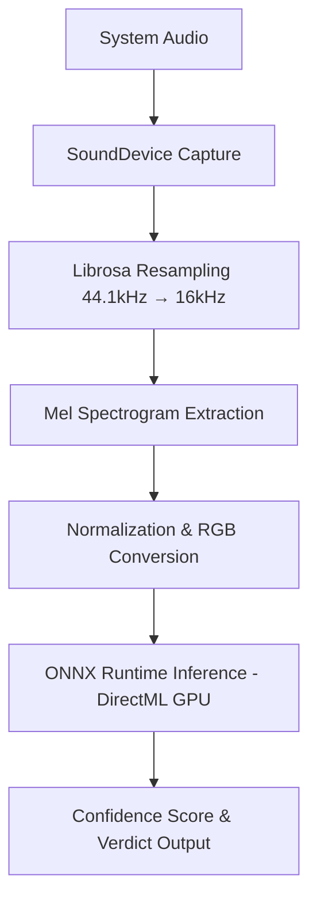

# 🛡️ Call-Guardian — Real-Time Deepfake Voice Detection

## 🚀 Overview
**Call-Guardian** is a real-time AI-powered deepfake voice detection system designed to monitor system audio and detect potentially synthetic or AI-generated speech using deep learning.

The system captures live audio, converts it into Mel spectrogram features, and performs GPU-accelerated inference using an ONNX-deployed **ResNet18** model.

## 🧠 Key Features
- 🎙️ **Real-time system audio monitoring**
- 🔊 **Stereo Mix loopback capture** (Windows)
- 📊 **Mel-Spectrogram feature extraction**
- 🧠 **CNN-based binary classification** (ResNet18)
- ⚡ **GPU-accelerated inference** via DirectML (AMD Optimized)
- 🛠️ **Numerically stable & low-latency pipeline**
- 🔁 **Continuous real-time detection loop**

## 🏗️ System Architecture


## 🧰 Technologies Used
- **Python 3.14**
- **NumPy**
- **Librosa** (Audio Analysis)
- **SoundDevice** (PortAudio loopback)
- **PyTorch** (Model Training/Creation)
- **ONNX & ONNX Runtime** (Model Deployment)
- **DirectML** (AMD GPU Acceleration)
- **Pillow** (Image Processing)

## 📂 Project Structure
```text
Call-Guardian/
│
├── main.py                # Core real-time pipeline
├── audio_capture.py       # WASAPI loopback audio stream
├── feature_extractor.py   # Mel spectrogram generator
├── inference_engine.py    # ONNX model loader & predictor
│
├── models/
│   └── deepfake_detector.onnx   # Deployed ResNet18 model
│
├── export_onnx.py         # Script to convert PyTorch to ONNX
├── verify_model_onnx.py   # Model verification & test
├── README.md
└── .gitignore
```

## ⚙️ Installation

### 1️⃣ Clone Repository
```bash
git clone https://github.com/becomingxdev/call-gaurdian-amd.git
cd call-gaurdian-amd
```

### 2️⃣ Create Virtual Environment
```bash
python -m venv scamguard_env
scamguard_env\Scripts\activate
```

### 3️⃣ Install Dependencies
```bash
pip install numpy librosa sounddevice Pillow onnxruntime-directml
```

## ▶️ Run the Project

**Prerequisites:**
1. **Windows Stereo Mix** must be enabled.
2. Ensure audio is playing through your system.

**Execute Pipeline:**
```bash
python main.py
```

## 📌 Important Notes
- **Placeholder Weights:** The current ONNX model uses placeholder/random weights for demonstration.
- **Production Accuracy:** For real-world usage, train the model using datasets such as **ASVspoof**.
- **Windows Only:** Optimized for Windows with DirectML GPU acceleration for AMD hardware.

## 🎯 Future Improvements
- [ ] Model training on ASVspoof dataset
- [ ] Confidence smoothing algorithms
- [ ] Silence & Noise detection
- [ ] Persistent audio stream optimization
- [ ] UI Overlay / Desktop implementation

---
*Built for the AMD SlingShot Hackathon*
